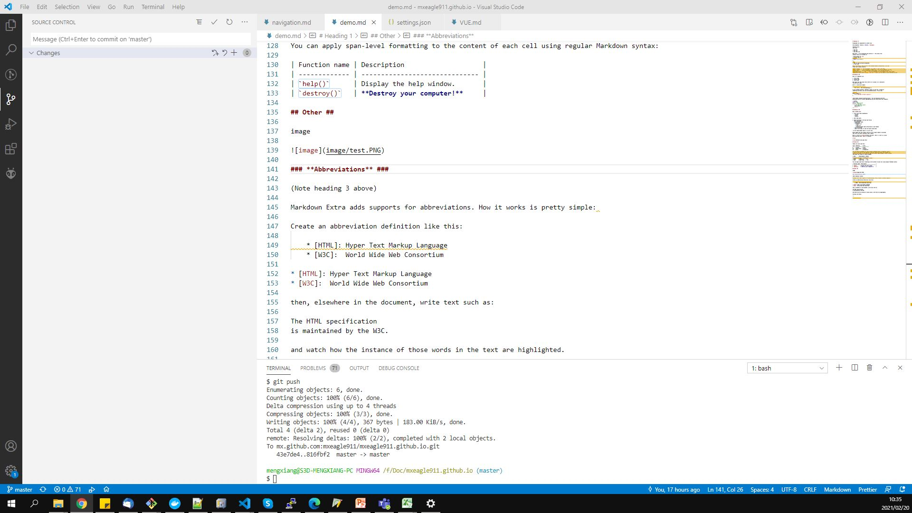

# Heading 1 #

Paragraphs are separated by a blank line.

2nd paragraph. *Italic*, **bold**, `monospace`.  

**Itemized lists**
look like:

* this one
* that one
* the other one

**Task list**  
`do not work in MDWiki`

* [ ] task1
* [ ] task2
* [ ] task3

- [x] Finish my changes
- [ ] Push my commits to GitHub
- [ ] Open a pull request

Note that --- not considering the asterisk --- the actual text
content starts at 3-columns in.

> Block quotes are `sss`
> written like so.
> ~~~java
> public void test() {
> 
> }
> ~~~
> They can span multiple paragraphs,
> if you like.

With `smartyPants` set to true in the markdown module configuration, you can 
format your content smartly:

 - Use 3 dashes `---` for an em-dash. (e.g. Note --- Its a cool day)
 - Use 2 dashes `--` for an en-dash or ranges (e.g. "It's all in chapters 12--14").
 - Three dots `...` will be converted to an ellipsis. (e.g. He goes on and on ...)
 - Straight quotes ( `"` and `'` ) will be converted to "curly double" and 'curly single'
 - Backticks-style quotes (<code>``like this``</code>) will be shown as curly entities as well

## Heading 2 ##

Here is a numbered list:

1. first item
2. second item
3. third item

Note again how the actual text starts at 3 columns in (3 characters
from the left side).

Here's a code block sample:

    # Let me re-iterate ...
    for i in 1 .. 10 { do-something(i) }

As you probably guessed, indented 4 spaces. By the way, instead of
indenting the block, you can use delimited blocks, if you like:

```python
define foobar() {
    print "Welcome to flavor country!";
}
```

(which makes copying & pasting easier). You can optionally mark the
delimited block for syntax highlighting with any code pretty CSS framework.

~~~python
import time
# Quick, count to ten!
for i in range(10):
    # (but not *too* quick)
    time.sleep(0.5)
    print i
~~~

## Heading 3 ##

Now a nested list:

1. First, get these ingredients:
   * carrots
   * celery
   * lentils

2. Boil some water.

3. Dump everything in the pot and follow  
   this algorithm:
   * find wooden spoon
   * manage pot
      * uncover pot  
      * stir  
      * cover pot  
      * balance wooden spoon precariously on pot handle  
   * wait 10 minutes
   * goto first step (or shut off burner when done)

* Do not bump wooden spoon or it will fall.

Notice again how text always lines up on at 3-space indents (including
that last line which continues item 3 above).

Here's a link to [a website](https://foo.bar). Here's a link to a [local
doc](local-doc.html). Here's a footnote  

[^xxx]

[^xxx]:Footnote text goes here.

## Tables ##

Tables can look like this:

size | material     | color
---- | ------------ | ------------
9    | leather      | brown
10   | hemp canvas  | natural
11   | glass        | transparent

You can specify alignment for each column by adding colons to separator lines. 
A colon at the left of the separator line will make the column left-aligned; a 
colon on the right of the line will make the column right-aligned; colons at both 
side means the column is center-aligned.

| Item      | Description | Value|
|:--------- |:-----------:|-----:|
| Computer<br>jadfs  | Desktop PC  |$1600 |
| Phone     | iPhone 5s   |  $12 |
| Pipe      | Steel Pipe  |   $1 |

You can apply span-level formatting to the content of each cell using regular Markdown syntax:

| Function name | Description                    |
| ------------- | ------------------------------ |
| `help()`      | Display the help window.       |
| `destroy()`   | **Destroy your computer!**     |

## Other ##

### Alerts ###

warning: warning, achtung, attention, warnung, atención, guarda, advertimiento, attenzione

Note: note, beachte, nota

Hint:  
hint, tip, tipp, hinweis, suggerimento
> sdf
> sdf
> asdf

[gimmick:yuml]( [HttpContext]uses -.->[Response] )

image show



### **Abbreviations** ###

(Note heading 3 above)

Markdown Extra adds supports for abbreviations. How it works is pretty simple: 

Create an abbreviation definition like this:

    * [HTML]: Hyper Text Markup Language
    * [W3C]:  World Wide Web Consortium

* [HTML]: Hyper Text Markup Language
* [W3C]:  World Wide Web Consortium

then, elsewhere in the document, write text such as:

The HTML specification
is maintained by the W3C.

and watch how the instance of those words in the text are highlighted.

Closing line below.

---

##### Done. #####
